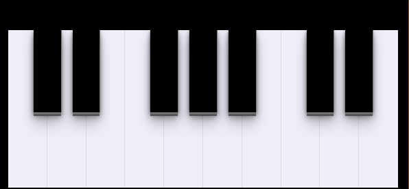

<h1 align="center">
    
</h1>

# piano-music
Implementação de um piano virtual em JavaScript

<p align="center">
  <a href="#rocket-tecnologias">Tecnologias</a>&nbsp;&nbsp;&nbsp;|&nbsp;&nbsp;&nbsp;
  <a href="#💻-projeto">Projeto</a>&nbsp;&nbsp;&nbsp;|&nbsp;&nbsp;&nbsp;
  <a href="#começando">Começando</a>&nbsp;&nbsp;&nbsp;|&nbsp;&nbsp;&nbsp;
  <a href="#memo-licença">Licença</a>
</p>

## :rocket: Tecnologias

Esse projeto foi desenvolvido com as seguintes tecnologias:

- [JavaScript](https://developer.mozilla.org/pt-BR/docs/Web/JavaScript)
- [CSS](https://developer.mozilla.org/pt-BR/docs/Web/CSS)
- [HTML](https://developer.mozilla.org/pt-BR/docs/Web/HTML)
- [SCSS](https://sass-lang.com/)

## 💻 Projeto
 
O piano-music é um projeto de um piano virtual.
### Backend-FrontEnd
 
 O projeto foi implementadoo basicamente em JavaScript, onde foi criado funções que possibilitam tocar o instrumento a partir do teclado do computador ou do click do mouse.<br>
 O mapeamento do teclado e das notas musicais está da seguinte forma:
nota      | tecla
--------- | ------
"C"       | A
"C#"      | W
"D"       | S
"D#"      | E
"E"       | D
"F"       | F
"F#"      | T
"G"       | G
"G#"      | Y
"A"       | H
"A#"      | U
"B"       | J
"C"       | K
"C#"      | O
"D"       | K
"D#"      | P
 

## Começando

 1. Clone esse repositorio ```git clone https://github.com/Rodrigo-Segui/piano-music.git```
 2. Inicie o index.html(linux).
  
 ## :memo: Licença

Esse projeto está sob a licença MIT. Veja o arquivo [LICENSE](https://github.com/Rodrigo-Segui/piano-music/blob/master/LICENSE) para mais detalhes.
